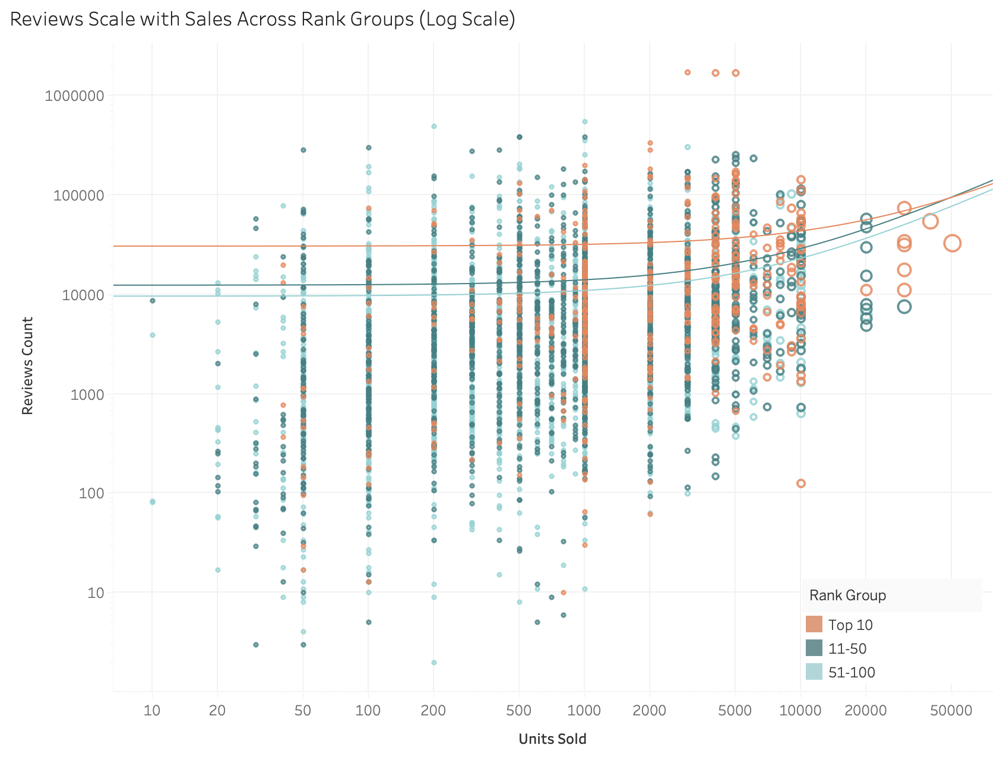
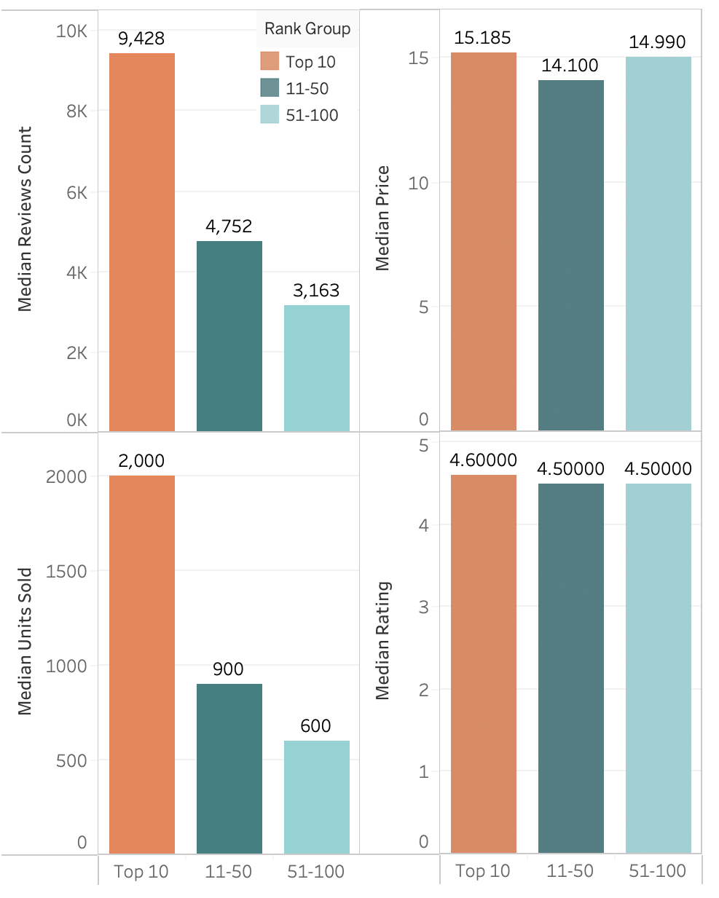
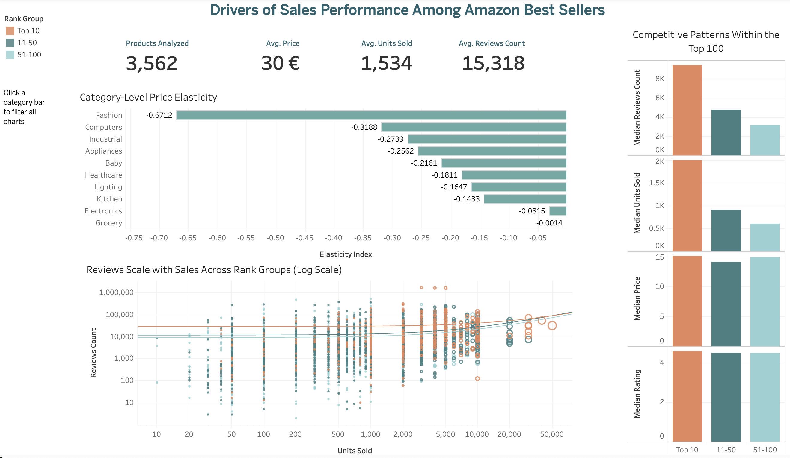

# Trust Signals vs Price in Amazon Best Sellers

### Data Analysis Project | Marketplace Strategy Case Study

This project analyzes whether trust signals (ratings & reviews) or price variation show stronger association with sales performance among Amazon best-selling products.

I collected data on 6,000+ Amazon Best Sellers through web scraping, and the analysis explores how social proof dynamics and pricing strategies relate to sales intensity within competitive marketplace environments.

## Project Preview

### Trust Signals vs Sales Performance

### Distribution of Review Volume

## Data

Collects 6000+ product datas including:
- product title
- price
- rating
- review count
- best seller rank
- units sold proxy
- product's url
- marketplace
- date

## Executive Summary

Key findings:

- Review volume shows stronger association with sales intensity than price variation.
- Product ratings exhibit limited variation among best sellers, suggesting a minimum quality threshold.
- Price differences alone do not strongly explain differences in sales performance within the top-performing tier.
- Social proof dynamics may reinforce sales momentum through visibility and credibility effects.

These findings highlight the importance of trust accumulation strategies for marketplace sellers competing at the top tier.

## Research Questions

This project investigates three key questions:

### 1. Trust Signals & Sales Performance
Do ratings and review volume meaningfully differentiate product performance among best sellers?

### 2. Price Sensitivity Across Categories
Does the relationship between price and sales vary across product categories?

### 3. What Distinguishes Top-Performing Best Sellers?
Are there measurable structural factors (price level, rating, review volume) that distinguish higher-performing products within the Top 100 rankings?

## Interactive Dashboard

An interactive Tableau dashboard was built to explore:

- Trust signals vs sales intensity
- Category-level price patterns
- Structural characteristics of best sellers

## Project Structure

amazon-trust-signals-analysis
│
├── data/
│   ├── raw_data.csv
│   └── cleaned_data.csv
│
├── notebooks/
│   └── exploratory_analysis.ipynb
│
├── visuals/
│   ├── trust_vs_sales_scatter.png
│   ├── reviews_distribution_rankgroup.png
│   └── tableau_dashboard.png
│
├── tableau_dashboard/
│   └── amazon_best_sellers_dashboard.twb
│
└── README.md

## Limitations

This analysis is correlational and does not establish causal relationships.

Important considerations include:

- Review volume may reflect past sales rather than cause them.
- Sales performance is approximated using proxy metrics.
- The dataset represents a cross-sectional snapshot.
- Amazon's ranking algorithm includes additional factors not observable in this dataset.

## Key Insight

Within the Amazon best-seller segment, review volume shows stronger association with sales intensity than price variation, suggesting that social proof may play a critical role in sustaining high-performing products in competitive marketplaces.

## Skills Demonstrated

- Web scraping with Selenium
- Data cleaning and transformation with Pandas
- Exploratory data analysis with Python
- Correlation analysis
- Data visualization (Matplotlib, Seaborn)
- Interactive dashboard development (Tableau)
- Marketplace strategy interpretation

## Author

Data analysis project completed as part of my data analytics bootcamp.

Focus areas:  
- marketplace analytics  
- e-commerce strategy  
- data visualization